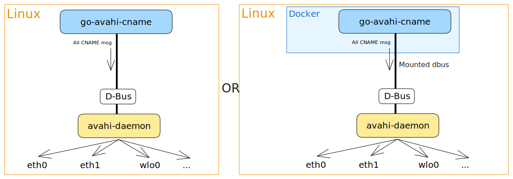

[](https://goreportcard.com/report/github.com/grishy/go-avahi-cname)


## What is go-avahi-cname?

It is a simple and lightweight project that allows you to publish CNAME records pointing to the local host over multicast DNS using the **Avahi** daemon, which is widely available in most Linux distributions. This means that you can access your local host using different names from any device on the same network, as long as they support Apple’s Bonjour protocol, which is compatible with Avahi.

### Goals

Here are some of the benefits of using go-avahi-cname:

- ✅ No dependencies: You only need the Avahi daemon running on your host, no other libraries or packages are required.
- ✅ Small footprint: The binary size is less than 3MB, and it consumes minimal resources while running.
- ✅ Support x86_64 and ARM: You can use go-avahi-cname on different architectures, such as Intel or Raspberry Pi.
- ✅ Release binaries and containers: You can download the pre-built binaries or use the Docker images for each version.

### How does it work?

The following diagram shows the basic architecture of go-avahi-cname:



As you can see, _go-avahi-cname_ communicates with the Avahi daemon via DBus, and publishes the CNAME records that you specify as arguments. The Avahi daemon then broadcasts these records over multicast DNS, so that other devices on the same network can resolve them.

## How to use and install?

You can specify any number of CNAMEs as arguments when running go-avahi-cname, with no length limit.
You can use either just the name (`name1`), which will create a record as a subdomain for the current machine, or you can write the full FQDN (`name1.hostname.local.` domain with a dot on the end) format.

For example, if your machine’s hostname is lab, you can run:

```plain
> ./go-avahi-cname git photo.local. example.lab.local.
2023/07/27 08:37:14 Creating publisher
2023/07/27 08:37:14 Formating CNAMEs:
2023/07/27 08:37:14   > 'git.lab.local.' (added current FQDN)
2023/07/27 08:37:14   > 'photo.local.'
2023/07/27 08:37:14   > 'example.lab.local.'
2023/07/27 08:37:14 Publishing every 5m0s and CNAME TTL=600s.
^C
2023/07/27 08:37:16 Closing publisher...
```

This will create three CNAME records pointing to your local host:

- `git.lab.local.`
- `photo.local.`
- `example.lab.local.`

You can then access your local host using any of these names from other devices on the same network.

### Installation options

There are two ways to install and run go-avahi-cname:

#### Binary

Binary files can be taken as artifacts for [the Release](https://github.com/grishy/go-avahi-cname/releases). In this case, it would be better to create a systemd service.

#### Container

The images for each version are in [the Packages section](https://github.com/grishy/go-avahi-cname/pkgs/container/go-avahi-cname).  
You need to provide the `/var/run/dbus/system_bus_socket` file to the container to be able to communicate with the host's Avahi daemon.

One-liner to run the container `v0.3.1`:

```bash
> docker run --restart=unless-stopped -d -v /var/run/dbus/system_bus_socket:/var/run/dbus/system_bus_socket ghcr.io/grishy/go-avahi-cname:v0.3.1 name1 name2.lab.local.
5a19790e06cca93016af6651d7af4046c24095a6909ace2fe26c3451fb98ceee

> docker logs 5a19790e06cca93016af6651d7af4046c24095a6909ace2fe26c3451fb98ceee
2023/07/27 08:49:02 Creating publisher
2023/07/27 08:49:02 Formating CNAMEs:
2023/07/27 08:49:02   > 'name1.lab.local.' (added current FQDN)
2023/07/27 08:49:02   > 'name2.lab.local.'
2023/07/27 08:49:02 Publishing every 5m0s ans CNAME TTL=600s.
```

Ansible task to run the container:

```yaml
- name: go-avahi-cname | Start container
  community.docker.docker_container:
    name: "go-avahi-cname"
    image: "ghcr.io/grishy/go-avahi-cname:v0.3.1"
    restart_policy: unless-stopped
    volumes:
      - "/var/run/dbus/system_bus_socket:/var/run/dbus/system_bus_socket" # access to avahi-daemon
    command: "name1 name2 git"
```

## Source of inspiration

- https://web.archive.org/web/20151016190620/http://www.avahi.org/wiki/Examples/PythonPublishAlias
- https://pypi.org/project/mdns-publisher/

## License

Copyright © 2022 [Sergei G.](https://github.com/grishy)  
This project is [MIT](./LICENSE) licensed.
