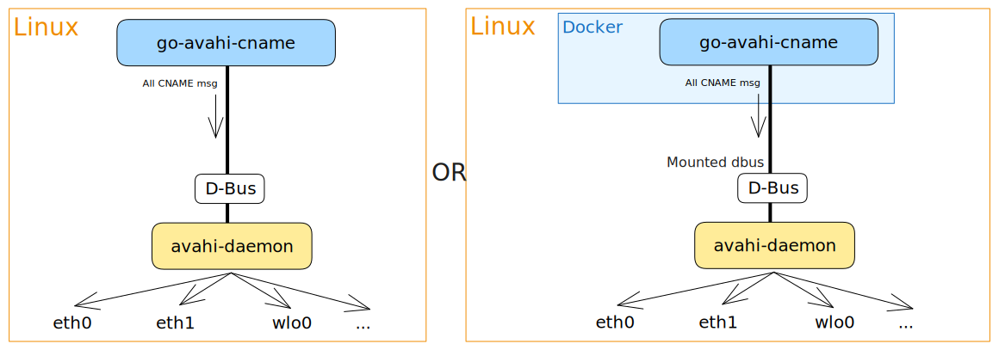

# go-avahi-cname

<p align="center">
  
   <br />
   <strong>Status: </strong>Maintained
</p>

<p align="center">
  
  
  
</p>

## TL;DR - How to start in subdomain mode

Redirect all "subdomains" to the machine( `*.hostname.local` -> `hostname.local`)  
Install:

1. _Binary_ (download from [Releases](https://github.com/grishy/go-avahi-cname/releases))
   ```
   ./go-avahi-cname subdomain
   ```
2. _Docker_
   ```bash
   docker run -d --network host -v "/var/run/dbus/system_bus_socket:/var/run/dbus/system_bus_socket" ghcr.io/grishy/go-avahi-cname:2.2.4
   ```

# What is go-avahi-cname?

It is a simple and lightweight project that allows you to publish CNAME records pointing to the local host over multicast DNS using the **Avahi** daemon, which is widely available in most Linux distributions. This means that you can access your local host using different names from any device on the same network, as long as they support mDNS.

## Goals

- **✅ No dependencies** - Requires only the Avahi daemon.
- **✅ Small footprint**
- **✅ Support x86_64 and ARM**
- **✅ Install as binaries or containers**

## Modes of Operation

- **Subdomain reply** - _I think you want this._ Listen to the traffic and if someone asks `*.hostname.local` (example: `name1.hostname.local`), we "redirect" to `hostname.local`.
- **Interval publishing** - Periodically broadcasts CNAME records for various `name1.hostname.local`, `git.any.local`...

---

# How does it work?

The tool communicates with the Avahi daemon via DBus to publish CNAME records.

## Subdomain CNAME reply


```plain
> ./go-avahi-cname subdomain -h
NAME:
   go-avahi-cname subdomain - Listen for all queries and publish CNAMEs for subdomains

USAGE:
   go-avahi-cname subdomain [command options]

OPTIONS:
   --ttl value   TTL of CNAME record in seconds (default: 600) [$TTL]
   --fqdn value  FQDN which will be used for CNAME. If empty, will be used current FQDN (default: hostname.local.) [$FQDN]
   --help, -h    show help
```

In this variant, we listen to the traffic with avahi-daemon for all questions with names and if they match ours, we send a command to avahi to answer it (send CNAME). The standard can be run without parameters, then we will resolve all requests that contain our hostname. For example, `git.lab.local` will be redirected to `lab.local`

## Interval publishing of CNAME records



As you can see, _go-avahi-cname_ communicates with the Avahi daemon via DBus, and publishes the CNAME records that you specify as arguments.

```plain
> ./go-avahi-cname cname -h
NAME:
   go-avahi-cname cname - Announce CNAME records for host via avahi-daemon

USAGE:
   go-avahi-cname cname [command options]

OPTIONS:
   --ttl value       TTL of CNAME record in seconds. How long they will be valid. (default: 600) [$TTL]
   --interval value  Interval of publishing CNAME records in seconds. How often to send records to other machines. (default: 300) [$INTERVAL]
   --fqdn value      Where to redirect. If empty, the Avahi FQDN (current machine) will be used (default: hostname.local.) [$FQDN]
   --help, -h        show help
```

You can specify any number of CNAMEs as arguments when running go-avahi-cname, with no length limit.
You can use either just the name (`name1`), which will create a record as a subdomain for the current machine, or you can write the full FQDN (`name1.hostname.local.` domain with a dot on the end) format.

For example, if your machine’s hostname is lab, you can run:

```plain
> ./go-avahi-cname cname git photo.local. example.lab.local.
18:08:55 INF creating publisher
18:08:55 INF getting FQDN from Avahi
18:08:55 INF running CNAME publisher fqdn=lab.local.
18:08:55 INF formatting CNAMEs
18:08:55 INF formatted CNAME cname=git.lab.local. note="added FQDN"
18:08:55 INF formatted CNAME cname=photo.local.
18:08:55 INF formatted CNAME cname=example.lab.local.
18:08:55 INF publishing CNAMEs interval=300 ttl=600
```

This will create three CNAME records pointing to your local host:

- `git.lab.local.`
- `photo.local.`
- `example.lab.local.`

You can then access your local host using any of these names from other devices on the same network.

## Installation options

There are two ways to install and run go-avahi-cname:

### Binary

Binary files can be taken as artifacts for [the Release](https://github.com/grishy/go-avahi-cname/releases). In this case, it would be better to create a systemd service.

### Container

The images for each version are in [the Packages section](https://github.com/grishy/go-avahi-cname/pkgs/container/go-avahi-cname).  
You need to provide the `/var/run/dbus/system_bus_socket` file to the container to be able to communicate with the host's Avahi daemon.

Docker Composer example:

```yaml
version: "3.3"
services:
  go-avahi-cname:
    network_mode: host
    volumes:
      - "/var/run/dbus/system_bus_socket:/var/run/dbus/system_bus_socket"
    image: "ghcr.io/grishy/go-avahi-cname:2.2.4"
```

Ansible task to run the container:

```yaml
- name: go-avahi-cname | Start container
  community.docker.docker_container:
    name: "go-avahi-cname"
    image: "ghcr.io/grishy/go-avahi-cname:2.2.4"
    restart_policy: unless-stopped
    network_mode: host
    volumes:
      - "/var/run/dbus/system_bus_socket:/var/run/dbus/system_bus_socket" # access to avahi-daemon
```

## Debugging

If you have any problems, you can run the tool with the `--debug` flag to get more information about what is happening.  
NOTE: `--debug` flag is available for both modes and should be used before the subcommand.

```bash
# Start app with debug logs in subdomain mode
./go-avahi-cname --debug subdomain
```

Also, you can use the `avahi-browse` tool to see the published records:

```bash
# List all services from the local network
avahi-browse -a
```

Or monitor DBus messages between the tool and the Avahi daemon, e.g. of [issue #22](https://github.com/grishy/go-avahi-cname/issues/22)

```bash
# Monitor DBus messages for Avahi
sudo busctl monitor org.freedesktop.Avahi
```

## Release

Reminder for me, just create a tag and push it.

```bash
# Replace 2.2.4 with the new version in project
git tag -a v2.2.4 -m "Release v2.2.4"
git push origin tag v2.2.4
```

## Source of inspiration

- [PythonPublishAlias](https://web.archive.org/web/20151016190620/http://www.avahi.org/wiki/Examples/PythonPublishAlias)
- [mdns-publisher](https://pypi.org/project/mdns-publisher/)
- [nfam/mdns-subdomain](https://github.com/nfam/mdns-subdomain)

## Logo

Generated by mix of Go Gopher and Avahi logo.

## License

© 2025 [Sergei G.](https://github.com/grishy)  
This project is [MIT](./LICENSE) licensed.
